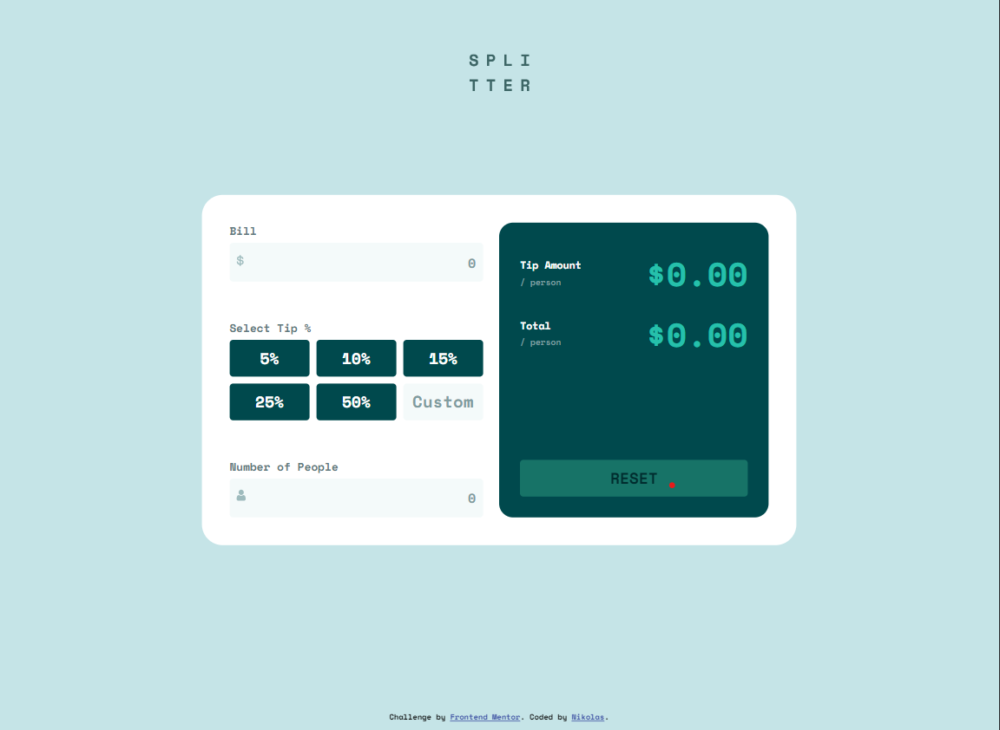
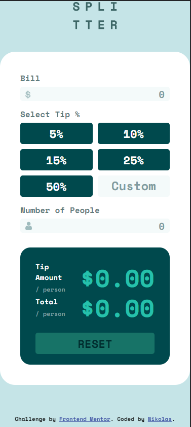
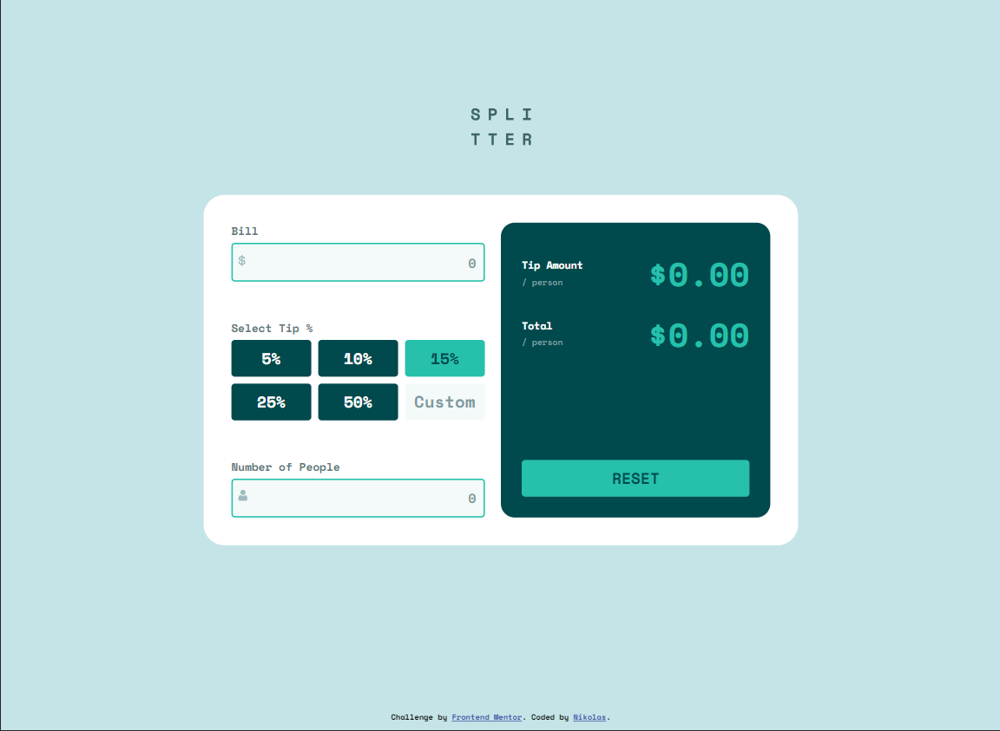

# Frontend Mentor - Tip calculator app solution

This is a solution to the [Tip calculator app challenge on Frontend Mentor](https://www.frontendmentor.io/challenges/tip-calculator-app-ugJNGbJUX). Frontend Mentor challenges help you improve your coding skills by building realistic projects.

## Table of contents

- [Frontend Mentor - Tip calculator app solution](#frontend-mentor---tip-calculator-app-solution)
  - [Table of contents](#table-of-contents)
  - [Overview](#overview)
    - [The challenge](#the-challenge)
    - [Screenshot](#screenshot)
    - [Links](#links)
  - [My process](#my-process)
    - [Built with](#built-with)
  - [Author](#author)

## Overview

### The challenge

Users should be able to:

- View the optimal layout for the app depending on their device's screen size
- See hover states for all interactive elements on the page
- Calculate the correct tip and total cost of the bill per person

### Screenshot

- Desktop:

- Mobile

- Desktop: active states

### Links

- Solution URL: [Solution URL here](https://www.frontendmentor.io/solutions/tip-calculator-app-using-react-_T6G5OlxgP)
- Live Site URL: [Live site URL here](https://nick-tip-calculator-app.netlify.app/)

## My process

### Built with

- React.js
- [React](https://reactjs.org/) - JS library

## Author

- Frontend Mentor - [@Fitsos17](https://www.frontendmentor.io/profile/Fitsos17)
- Github - [@Fitsos17](https://github.com/Fitsos17)
